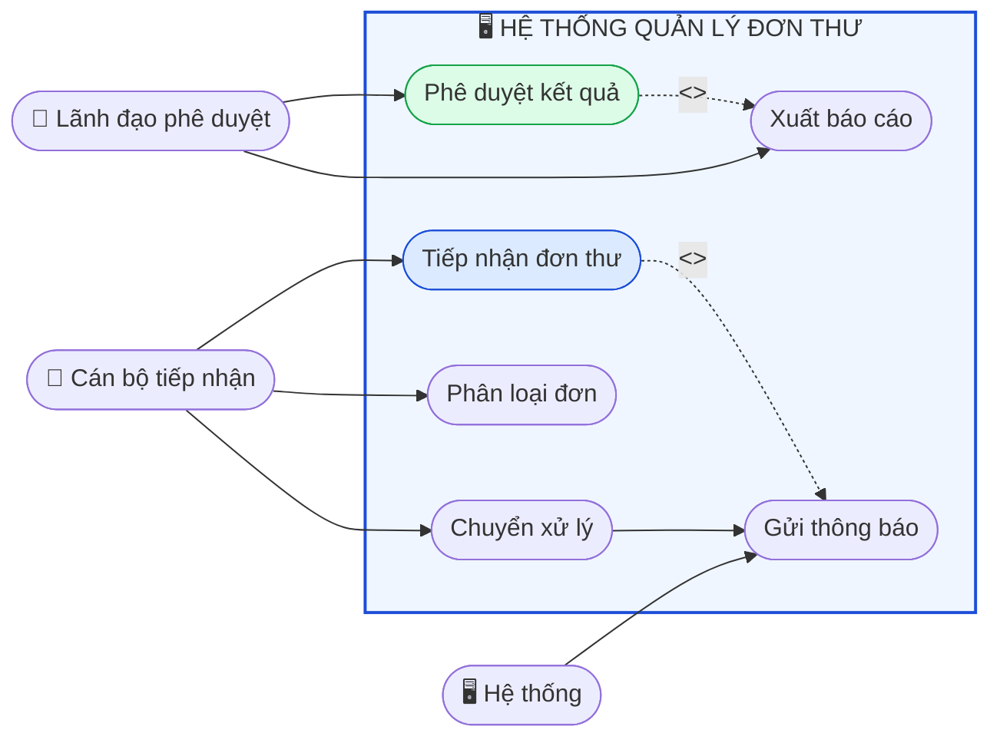
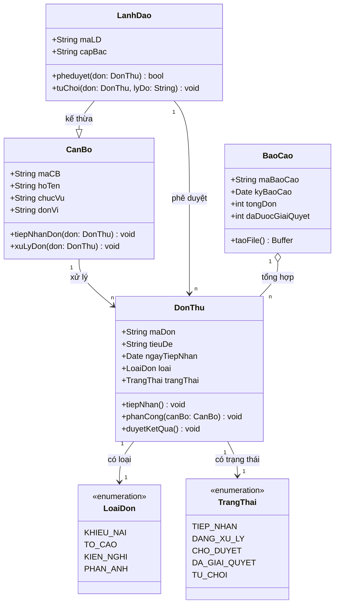
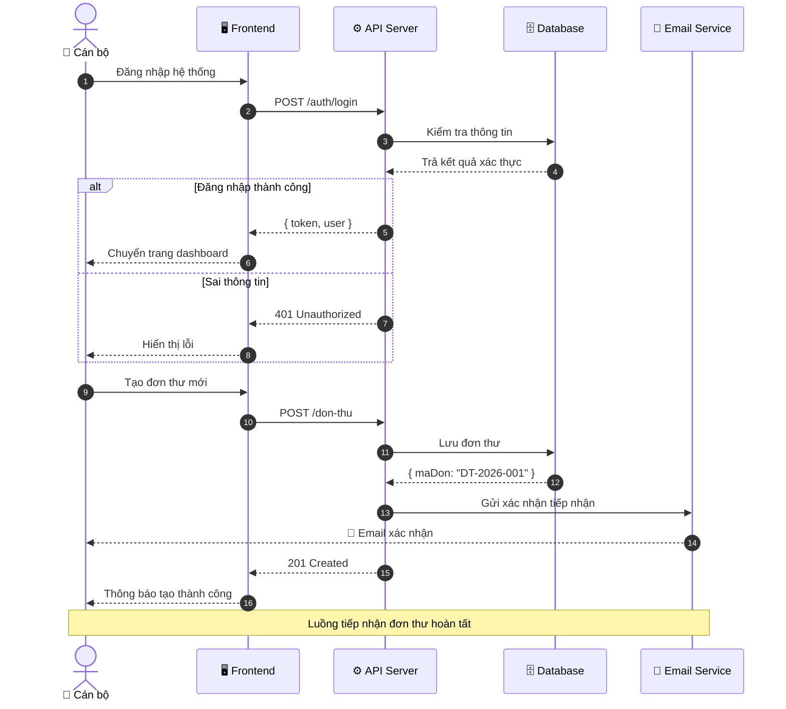
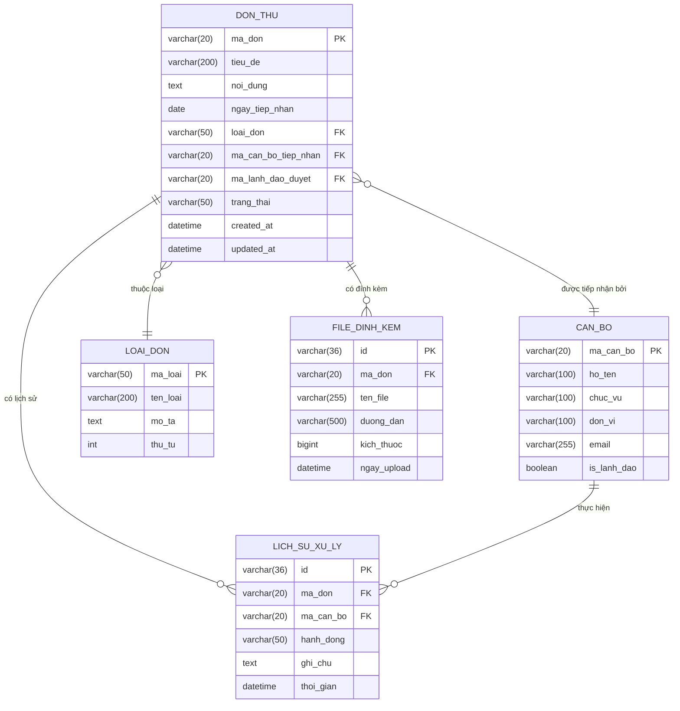
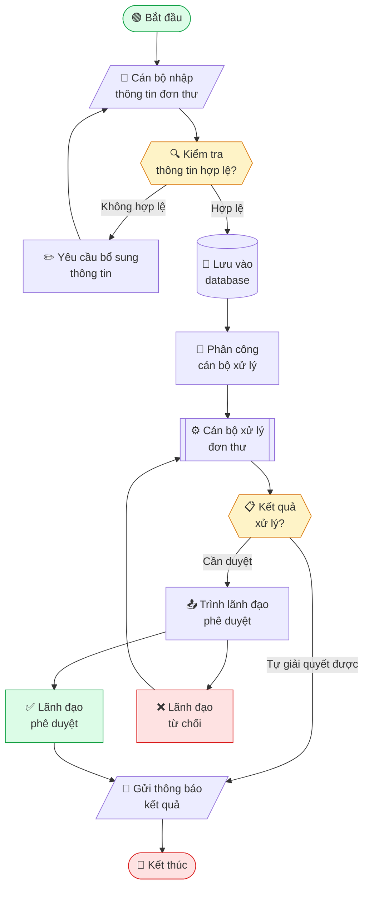
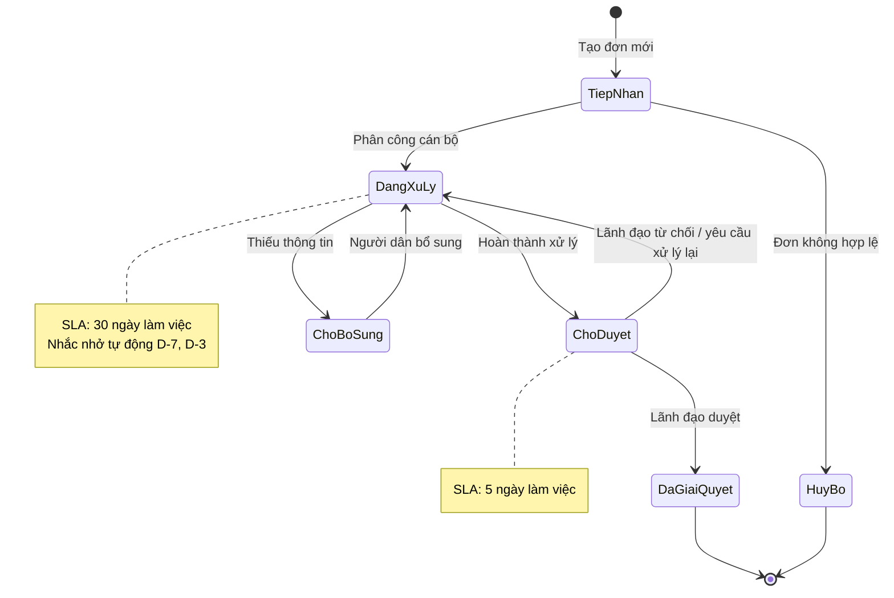
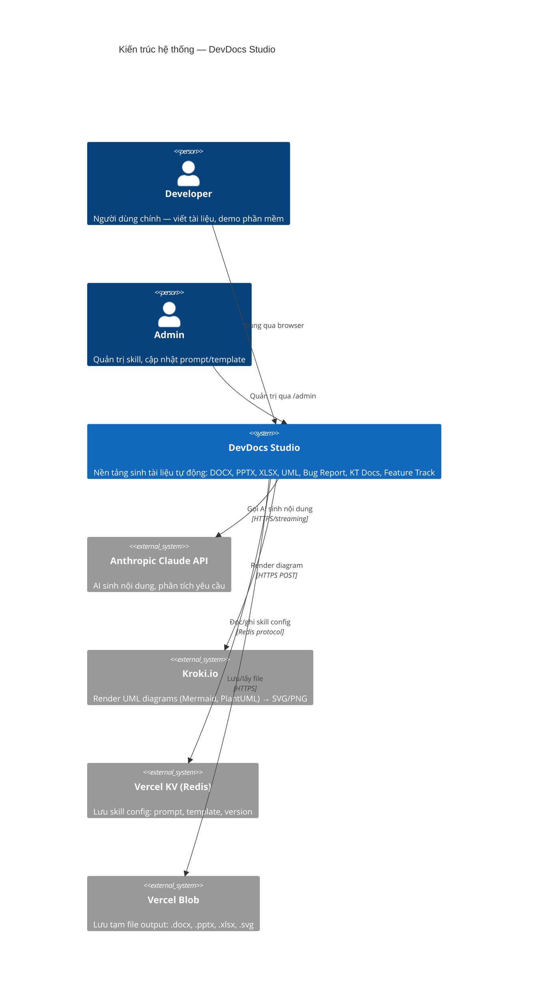

# UML Diagram creation and rendering

## Overview

UML diagrams trong skill này được viết bằng **Mermaid syntax** (text-based, dễ version control)
và render thành SVG/PNG thông qua **Kroki.io** (external render API, miễn phí, không cần binary).

> **Tại sao không dùng Mermaid CLI trực tiếp?**
> `@mermaid-js/mermaid-cli` dùng Puppeteer (headless Chromium) — không thể chạy trên
> Vercel Serverless Functions (không có binary execution). Kroki.io giải quyết vấn đề này
> bằng cách nhận Mermaid text qua HTTP POST và trả về SVG/PNG.
User input (mô tả diagram)
↓
Claude API → sinh Mermaid code
↓
POST https://kroki.io/{type}/{format}
Body: { diagram: "<mermaid code>" }
↓
SVG / PNG buffer
↓
Vercel Blob (lưu tạm) → download URL
↓ (optional)
Nhúng vào DOCX / PPTX

**Các loại diagram được hỗ trợ:**

| Loại | Mermaid type | Kroki endpoint | Dùng khi |
|------|-------------|----------------|----------|
| Use Case | `graph` / `flowchart` | `mermaid` | Mô tả actor + chức năng hệ thống |
| Class Diagram | `classDiagram` | `mermaid` | Thiết kế OOP, domain model |
| Sequence Diagram | `sequenceDiagram` | `mermaid` | Luồng giao tiếp giữa các thành phần |
| ERD | `erDiagram` | `mermaid` | Thiết kế database |
| Flowchart | `flowchart` | `mermaid` | Quy trình nghiệp vụ, flow xử lý |
| State Diagram | `stateDiagram-v2` | `mermaid` | Vòng đời đối tượng, trạng thái |
| Activity | `flowchart TD` | `mermaid` | Swimlane, luồng hoạt động |
| C4 Architecture | `C4Context` | `mermaid` | Kiến trúc hệ thống cấp cao |
| PlantUML | (syntax riêng) | `plantuml` | Backup khi Mermaid không đủ |

---

## Quick Reference

| Task | Approach |
|------|----------|
| Render Mermaid → SVG | `POST https://kroki.io/mermaid/svg` |
| Render Mermaid → PNG | `POST https://kroki.io/mermaid/png` |
| Render PlantUML → SVG | `POST https://kroki.io/plantuml/svg` |
| Nhúng SVG vào DOCX | Dùng `docx` + `ImageRun` với SVG buffer |
| Nhúng PNG vào PPTX | Dùng `pptxgenjs` + `addImage` |
| Lưu tạm output | Vercel Blob — `put(filename, buffer)` |
| Giới hạn diagram | Max ~200 nodes cho Mermaid qua Kroki |
| Fallback nếu Kroki lỗi | `mermaid.ink` API (xem phần Fallback) |

---

## API Integration — Kroki.io

### Base request

```typescript
// /api/skills/uml/route.ts
import { put } from '@vercel/blob';

const KROKI_BASE = 'https://kroki.io';

export async function renderDiagram(
  mermaidCode: string,
  format: 'svg' | 'png' = 'svg',
  type: 'mermaid' | 'plantuml' | 'graphviz' = 'mermaid'
): Promise<Buffer> {
  const res = await fetch(`${KROKI_BASE}/${type}/${format}`, {
    method: 'POST',
    headers: { 'Content-Type': 'application/json' },
    body: JSON.stringify({ diagram_source: mermaidCode }),
  });

  if (!res.ok) {
    const errText = await res.text();
    throw new Error(`Kroki render failed (${res.status}): ${errText}`);
  }

  const buffer = Buffer.from(await res.arrayBuffer());
  return buffer;
}
```

### Lưu output lên Vercel Blob

```typescript
async function renderAndStore(
  mermaidCode: string,
  filename: string,
  format: 'svg' | 'png' = 'svg'
): Promise<{ url: string; buffer: Buffer }> {
  const buffer = await renderDiagram(mermaidCode, format);
  const contentType = format === 'svg' ? 'image/svg+xml' : 'image/png';

  const blob = await put(`uml/${filename}.${format}`, buffer, {
    access: 'public',
    contentType,
    addRandomSuffix: true,
  });

  return { url: blob.url, buffer };
}
```

### Fallback — mermaid.ink

```typescript
// Nếu Kroki.io không khả dụng, dùng mermaid.ink
function getMermaidInkUrl(mermaidCode: string, format: 'svg' | 'img' = 'svg'): string {
  const encoded = Buffer.from(mermaidCode, 'utf-8').toString('base64url');
  return `https://mermaid.ink/${format}/${encoded}`;
}
// SVG: https://mermaid.ink/svg/{base64url}
// PNG: https://mermaid.ink/img/{base64url}?type=png
```

### Full API handler

```typescript
export async function POST(req: Request) {
  const { diagramType, description, format = 'svg', embedIn } = await req.json();

  // 1. Gọi Claude API sinh Mermaid code
  const mermaidCode = await generateMermaidCode(diagramType, description);

  // 2. Render qua Kroki
  const { url, buffer } = await renderAndStore(
    mermaidCode,
    `${diagramType}-${Date.now()}`,
    format
  );

  // 3. Optional: nhúng vào DOCX/PPTX
  let embedUrl: string | undefined;
  if (embedIn === 'docx') {
    embedUrl = await embedIntoDocx(buffer, format, description);
  } else if (embedIn === 'pptx') {
    embedUrl = await embedIntoPptx(buffer, format, description);
  }

  return Response.json({
    mermaidCode,
    diagramUrl: url,
    embedUrl,
    format,
  });
}
```

---

## Input Schema

```typescript
type UmlSkillInput = {
  diagramType:
    | 'usecase'
    | 'class'
    | 'sequence'
    | 'erd'
    | 'flowchart'
    | 'state'
    | 'activity'
    | 'c4'
    | 'component'
    | 'deployment';

  // Mô tả bằng ngôn ngữ tự nhiên — Claude sẽ dịch sang Mermaid
  description: string;

  // Nếu có sẵn Mermaid code, dùng thẳng (bỏ qua Claude)
  mermaidCode?: string;

  format?: 'svg' | 'png';           // default: svg
  embedIn?: 'none' | 'docx' | 'pptx'; // default: none

  // Context thêm để AI hiểu domain
  projectName?: string;
  moduleName?:  string;
  actors?:      string[];           // Dùng cho use case
  entities?:    string[];           // Dùng cho ERD, class
  language?:    'vi' | 'en';        // Ngôn ngữ nhãn trong diagram

  // Style overrides
  theme?: 'default' | 'neutral' | 'dark' | 'forest' | 'base';
  direction?: 'TB' | 'TD' | 'BT' | 'RL' | 'LR'; // Flowchart direction
};
```

---

## Mermaid Templates theo loại diagram

### 1. Use Case Diagram

> Mermaid không có native use case syntax — dùng `flowchart` để giả lập.



**Input schema cho Use Case:**

```typescript
type UseCaseInput = {
  systemName:  string;
  actors: Array<{
    id:    string;
    name:  string;
    type?: 'human' | 'system'; // emoji: 👤 hoặc 🖥️
  }>;
  useCases: Array<{
    id:       string;
    name:     string;
    actorIds: string[];  // actor nào thực hiện
  }>;
  relationships?: Array<{
    from:  string;
    to:    string;
    type:  'include' | 'extend' | 'association';
  }>;
};
```

---

### 2. Class Diagram



**Input schema cho Class Diagram:**

```typescript
type ClassDiagramInput = {
  classes: Array<{
    name:        string;
    stereotype?: 'abstract' | 'interface' | 'enumeration' | 'service';
    attributes:  Array<{
      visibility: '+' | '-' | '#' | '~';
      type:       string;
      name:       string;
    }>;
    methods: Array<{
      visibility: '+' | '-' | '#' | '~';
      name:       string;
      params?:    string;
      returnType: string;
    }>;
  }>;
  relationships: Array<{
    from:        string;
    to:          string;
    type:        'inheritance' | 'composition' | 'aggregation' | 'association' | 'dependency' | 'realization';
    fromCard?:   string; // "1", "n", "0..1"
    toCard?:     string;
    label?:      string;
  }>;
};
```

---

### 3. Sequence Diagram



**Input schema cho Sequence:**

```typescript
type SequenceDiagramInput = {
  title?:       string;
  participants: Array<{
    id:      string;
    name:    string;
    type?:   'actor' | 'participant' | 'database' | 'service';
    emoji?:  string;
  }>;
  steps: Array<{
    from:       string;
    to:         string;
    message:    string;
    arrow?:     '->' | '-->>' | '->>'; // solid, dashed, async
    activate?:  boolean;
    deactivate?: boolean;
    note?:      string;
  }>;
  alternatives?: Array<{
    condition:  string;
    steps:      any[]; // nested steps
    elseSteps?: any[];
  }>;
  loops?: Array<{
    condition: string;
    steps:     any[];
  }>;
};
```

---

### 4. ERD (Entity Relationship Diagram)



**Input schema cho ERD:**

```typescript
type ErdInput = {
  entities: Array<{
    name:    string; // tên bảng, UPPER_SNAKE_CASE
    columns: Array<{
      type:        string;   // varchar(20), int, datetime, ...
      name:        string;   // tên cột
      constraint?: 'PK' | 'FK' | 'UK' | null;
      comment?:    string;
    }>;
  }>;
  relationships: Array<{
    from:        string;  // tên entity
    to:          string;
    fromCard:    '||' | '}o' | '|o' | '}|'; // crow's foot notation
    toCard:      '||' | 'o{' | 'o|' | '|{';
    label:       string;  // mô tả relationship
    identifying?: boolean;
  }>;
};
```

---

### 5. Flowchart (Quy trình nghiệp vụ)



---

### 6. State Diagram



---

### 7. C4 Architecture Diagram



---

## Embedding — Nhúng diagram vào DOCX/PPTX

### Nhúng SVG vào DOCX

```typescript
import { ImageRun, Paragraph } from 'docx';
import { renderDiagram } from './kroki';

async function diagramParagraph(mermaidCode: string, caption?: string) {
  // Kroki trả về SVG — docx-js không nhận SVG trực tiếp
  // Cần convert sang PNG trước (dùng sharp hoặc Kroki PNG endpoint)
  const pngBuffer = await renderDiagram(mermaidCode, 'png');

  return [
    new Paragraph({
      children: [
        new ImageRun({
          type: 'png',
          data: pngBuffer,
          transformation: { width: 600, height: 400 }, // điều chỉnh theo nội dung
          altText: { title: 'UML Diagram', description: caption ?? '', name: 'diagram' },
        }),
      ],
      spacing: { before: 200, after: 200 },
    }),
    ...(caption ? [new Paragraph({
      children: [new TextRun({ text: `Hình: ${caption}`, italics: true, size: 20, color: '6B7280' })],
      alignment: AlignmentType.CENTER,
    })] : []),
  ];
}
```

### Nhúng PNG vào PPTX

```typescript
async function addDiagramSlide(pptx: pptxgen, mermaidCode: string, title: string) {
  const pngBuffer = await renderDiagram(mermaidCode, 'png');
  const base64 = pngBuffer.toString('base64');

  const slide = pptx.addSlide();
  slide.addText(title, {
    x: 0.5, y: 0.3, w: '90%', h: 0.5,
    fontSize: 20, bold: true, color: '0B3A6E',
  });
  slide.addImage({
    data: `data:image/png;base64,${base64}`,
    x: 0.5, y: 1.0, w: 9.0, h: 5.5,
  });
}
```

---

## System Prompt cho Skill-4

Đưa vào Vercel KV với key `skill:uml:prompt`:

```txt
You are the UML skill for DevDocs Studio.

Your job is to generate syntactically correct Mermaid diagram code for Vietnamese software projects.

Core objectives:
1. Analyze the user's description and identify the most appropriate diagram type.
2. Generate valid Mermaid syntax — the code will be sent directly to Kroki.io for rendering.
3. Use Vietnamese labels for business concepts (entity names, actor names, use case names).
4. Use English identifiers for code-level concepts (class names, method names, DB column names).
5. Keep diagrams focused: maximum 15-20 nodes/entities per diagram. If more are needed, suggest splitting.
6. Add meaningful relationships with labels, not just arrows.
7. Apply sensible Mermaid style directives (fill, stroke colors) for readability.
8. For ERD: use crow's foot notation, include PK/FK constraints, use snake_case for column names.
9. For class diagrams: include visibility modifiers (+/-/#), stereotypes for interfaces/enums.
10. For sequence diagrams: use autonumber, add participant emojis for visual clarity.

Supported diagram types and Mermaid keywords:
- usecase → flowchart LR with subgraph system boundary
- class → classDiagram
- sequence → sequenceDiagram
- erd → erDiagram
- flowchart → flowchart TD (default) or LR
- state → stateDiagram-v2
- activity → flowchart TD with swimlane subgraphs
- c4 → C4Context or C4Container
- component → graph LR with subgraphs

Output format:
Return JSON:
{
  "diagramType": "<type>",
  "mermaidCode": "<full mermaid code as string>",
  "title": "<diagram title in Vietnamese>",
  "description": "<1-2 sentences explaining what this diagram shows>",
  "suggestedFilename": "<snake_case_filename>"
}

Constraints:
- mermaidCode must be valid Mermaid v10+ syntax.
- No markdown code fences in mermaidCode field (raw code only).
- Maximum diagram complexity: 20 nodes/classes/entities.
- Never include credentials, passwords, or sensitive data even if mentioned in description.
- Node IDs must not contain spaces — use camelCase or PascalCase.
- String labels containing spaces or special characters must be quoted: ["Label có dấu"].
```

---

## Admin Config cho Skill-4

Lưu trong Vercel KV:
skill:uml:prompt → system prompt (trên)
skill:uml:kroki-base-url → https://kroki.io (có thể override sang self-hosted)
skill:uml:default-format → svg
skill:uml:default-theme → neutral
skill:uml:max-nodes → 20
skill:uml:embed-default → none | docx | pptx
skill:uml:versions → version history của prompt

---

## Critical Rules cho Skill UML

- **Không dùng Mermaid CLI** (puppeteer) trên Vercel — không có binary execution, sẽ crash
- **Kroki.io POST body phải là JSON** với field `diagram_source`, không phải raw text
- **SVG không nhúng được vào docx-js** — luôn dùng PNG endpoint khi embed vào DOCX/PPTX
- **Node ID không được có dấu cách** — dùng camelCase/PascalCase: `DonThu` không phải `Đơn thư`
- **Label có ký tự đặc biệt hoặc tiếng Việt phải dùng nháy đôi**: `CB["Cán bộ xử lý"]`
- **`erDiagram` dùng `||--o{`** (crow's foot), không dùng arrow `->`
- **`sequenceDiagram` dùng `->>` cho async**, `->>`  cho sync — nhầm sẽ lỗi render
- **Giới hạn diagram phức tạp** — Kroki.io timeout với graph > 50 nodes; tách diagram nhỏ
- **`C4Context` cần import đúng** — không phải built-in Mermaid, cần đúng version
- **Vercel Blob URL hết hạn** — set `cacheControlMaxAge: 3600` và thông báo người dùng download ngay
- **Fallback tự động**: nếu Kroki trả `5xx` → retry 1 lần → chuyển sang `mermaid.ink`
- **PNG size** từ Kroki ≈ 2x SVG — Vercel Blob free tier 500MB/month, không để ảnh quá to
- **Theme `neutral`** phù hợp nhất cho tài liệu nhà nước — không quá màu, đọc được trên máy in

---

## Dependency Map
Skill-4 (UML)
├── Kroki.io API → external HTTP, không cần npm
├── @vercel/blob → lưu output
├── sharp (optional) → resize PNG trước khi nhúng DOCX
├── → Skill-1 (DOCX) → nhúng diagram vào Word document
└── → Skill-2 (PPTX) → nhúng diagram vào slide